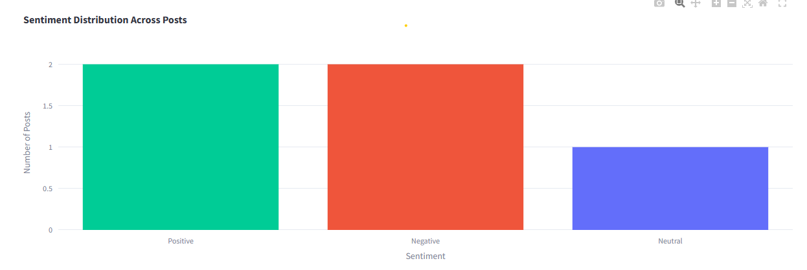
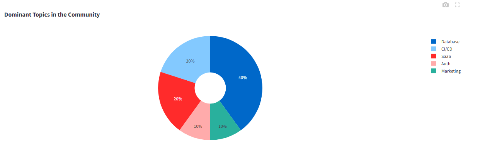
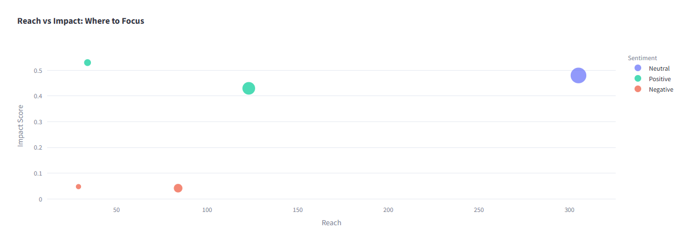
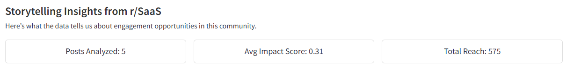

# Niche Insights 🚀

[](https://www.python.org/)
[](LICENSE)
[](https://streamlit.io/)

**Niche Insights: A Python app that fetches Reddit posts, generates AI-driven responses using Hugging Face, sends them to Slack for review, and delivers data storytelling through an enhanced Streamlit dashboard.**

---

## 📖 Project Overview

`Niche Insights` is a powerful tool designed for marketing consultancies and businesses aiming to engage niche Reddit communities. It automates subreddit monitoring, classifies topics, generates AI-powered responses, and notifies teams via Slack. The latest version introduces advanced data storytelling with interactive visualizations and actionable insights, built on a sleek Streamlit interface, to drive thought leadership and strategic engagement in specialized domains.

### ✨ Key Features
- **Post Retrieval**: Fetches top "hot" posts from any subreddit using the Reddit API (PRAW).
- **Topic Classification**: Identifies key topics (e.g., "SaaS," "Marketing," "CI/CD") with keyword analysis.
- **AI Response Generation**: Creates tailored responses via Hugging Face, with fallback to a customizable knowledge base.
- **Slack Integration**: Sends posts and responses to Slack with "Approve/Reject" buttons for team review.
- **Data Storytelling Dashboard**: Features sentiment bar charts, topic pie charts, and reach-vs-impact scatter plots in Streamlit.
- **Actionable Insights**: Highlights top opportunities, sentiment trends, and engagement potential with narrative summaries.
- **Analytics**: Provides sentiment analysis, impact scores, and reach metrics for data-driven decisions.

---

## 📸 Screenshots

### Responses Generated in Streamlit
  
*Caption: Reddit posts from `r/Marketing` with AI-generated responses displayed in the Streamlit UI.*

### Sentiment Distribution Visualization
  
*Caption: Bar chart showing the sentiment breakdown (Positive, Neutral, Negative) of analyzed posts.*

### Topic Distribution Visualization
  
*Caption: Interactive pie chart visualizing dominant topics (e.g., SaaS, Marketing) in the community.*

### Reach vs Impact Scatter Plot
  
*Caption: Scatter plot highlighting posts by reach and impact, sized by comment count and colored by sentiment.*

### Storytelling Insights
  
*Caption: Narrative insights section identifying top opportunities and engagement potential.*

---

## 🛠️ Prerequisites

To run `Niche Insights`, ensure you have:
- **Python**: Version 3.8 or higher.
- **Reddit API Access**: Developer credentials from a Reddit account ([Reddit Apps](https://www.reddit.com/prefs/apps)).
- **Hugging Face API Token**: An API key from [Hugging Face](https://huggingface.co/settings/tokens).
- **Slack Workspace**: A channel and webhook URL ([Slack API](https://api.slack.com/messaging/webhooks)).
- **Git**: For cloning the repository.

---

## 🚀 Setup Instructions

Follow these steps to set up and run the app locally:

1. **Clone the Repository**:
   ```bash
   git clone https://github.com/yourusername/Niche-Insights-Marketing-Consultancy.git
   cd Niche-Insights-Marketing-Consultancy
