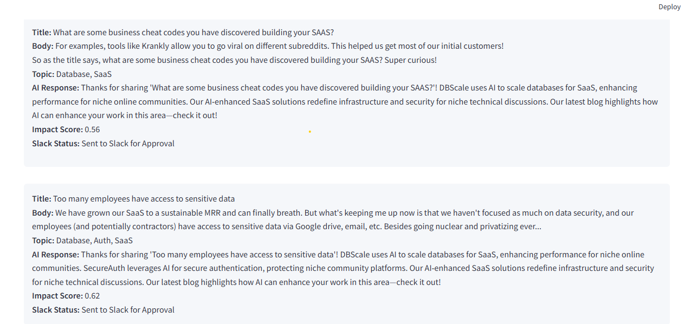

# Niche Insights

**Niche Insights: A Python app that fetches Reddit posts, generates AI-driven responses using Hugging Face, and sends them to Slack for team review, with Streamlit-based analytics.**

## Overview

`Niche Insights` is a tool designed to help marketing consultancies or businesses monitor and engage with niche Reddit communities. It fetches posts from specified subreddits, classifies their topics, generates tailored responses using the Hugging Face API (with a static fallback), sends them to Slack for approval, and provides a web interface with analytics via Streamlit.

### Features
- **Post Retrieval**: Fetches "hot" posts from a subreddit using the Reddit API.
- **Topic Classification**: Identifies topics (e.g., "SaaS," "Marketing") with keyword matching.
- **Response Generation**: Creates AI responses via Hugging Face or static replies from a knowledge base.
- **Slack Integration**: Sends posts and responses to a Slack channel with "Approve/Reject" buttons.
- **Web UI**: Displays results and analytics in Streamlit.
- **Analytics**: Includes sentiment analysis and a topic distribution pie chart.

## Screenshots

### Responses Generated in Streamlit
  
*Caption: Example of Reddit posts with generated responses displayed in the Streamlit UI.*

### Topic Distribution Visualization
  
*Caption: Pie chart showing the distribution of topics identified in the fetched posts.*

## Prerequisites

- Python 3.8+
- A Reddit account with API access
- A Hugging Face account with an API token
- A Slack workspace with a channel and webhook

## Setup

1. **Clone the Repository**:
   ```bash
   git clone https://github.com/yourusername/niche_insights.git
   cd niche_insights
