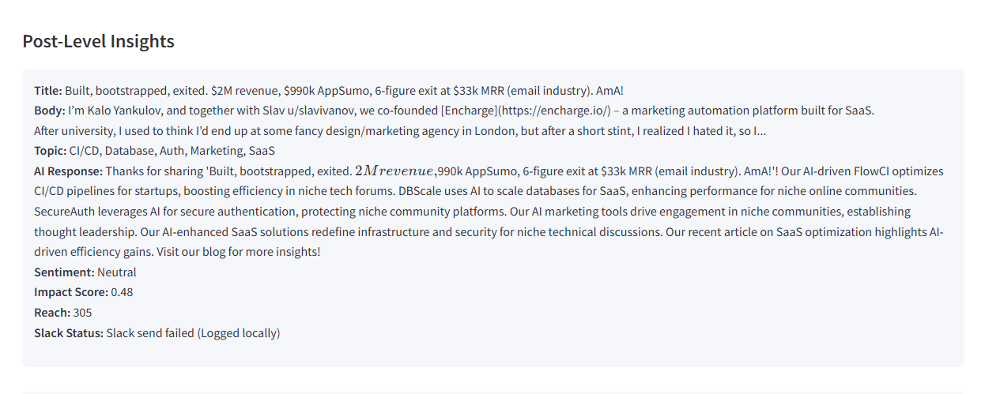

# Niche Insights 🚀

[](https://www.python.org/)
[](LICENSE)
[](https://streamlit.io/)

**Niche Insights: A Python app that fetches Reddit posts, generates AI-driven responses using Hugging Face, and sends them to Slack for team review, with Streamlit-based analytics.**

---

## 📖 Project Overview

`Niche Insights` is an innovative tool crafted for marketing consultancies, startups, or businesses looking to tap into niche Reddit communities. It automates the process of monitoring subreddit discussions, analyzing content, generating tailored AI responses, and notifying teams via Slack. With a sleek Streamlit interface, it also delivers actionable analytics to help users engage effectively and establish thought leadership in specialized domains.

### ✨ Key Features
- **Post Retrieval**: Pulls "hot" posts from any subreddit using the Reddit API.
- **Topic Classification**: Detects topics (e.g., "SaaS," "Marketing," "CI/CD") via keyword matching.
- **Response Generation**: Crafts AI-powered responses with Hugging Face or falls back to static replies from a customizable knowledge base.
- **Slack Integration**: Delivers posts and responses to a Slack channel with interactive "Approve/Reject" buttons.
- **Interactive Web UI**: Presents results and insights through a Streamlit dashboard.
- **Analytics**: Offers sentiment analysis (Positive/Negative/Neutral) and a topic distribution pie chart.

---

## 📸 Screenshots

### Responses Generated in Streamlit
  
*Caption: A glimpse of Reddit posts from `r/Marketing` with AI-generated responses in the Streamlit UI.*

### Topic Distribution Visualization
  
*Caption: Interactive pie chart visualizing topic distribution (e.g., SaaS, Marketing) from analyzed posts.*

---

## 🛠️ Prerequisites

To run `Niche Insights`, you’ll need:
- **Python**: Version 3.8 or higher.
- **Reddit API Access**: A Reddit account with developer credentials.
- **Hugging Face API Token**: An account with API access for AI response generation.
- **Slack Workspace**: A channel and webhook for notifications.

---

## 🚀 Setup Instructions

Follow these steps to get started:

1. **Clone the Repository**:
   ```bash
   git clone https://github.com/yourusername/niche_insights.git
   cd niche_insights
